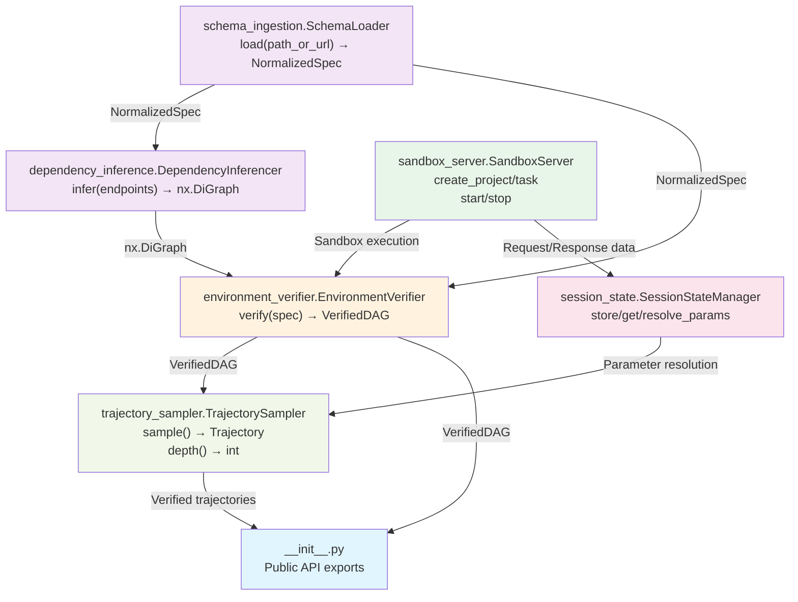

# EnvFactory Architecture

## System Overview

EnvFactory is a Python package designed to enable stateful API environment verification and calibrated trajectory synthesis for training agentic systems on tool-use tasks. The system ingests OpenAPI specifications, infers dependency graphs between API endpoints, verifies those dependencies through sandbox execution, maintains session state across multi-step API interactions, and generates realistic training trajectories. By combining schema validation, dependency analysis, sandboxed execution, and trajectory sampling, EnvFactory provides a complete pipeline for building and testing complex multi-step API interaction scenarios.

## Module Dependency Diagram



## Module Descriptions

### `schema_ingestion.py`
**Role:** Entry point for specification loading and normalization.

The `SchemaLoader` class handles ingestion of API specifications from files or URLs, transforming raw OpenAPI/schema documents into a normalized internal representation (`NormalizedSpec`). This module abstracts away format-specific parsing and provides a uniform interface for downstream modules to work with standardized endpoint definitions, parameter schemas, and response structures.

**Key Methods:**
- `load(path_or_url: str) → NormalizedSpec`: Parse and normalize a specification

### `dependency_inference.py`
**Role:** Construct dependency graphs between API endpoints.

The `DependencyInferencer` class analyzes endpoint definitions to determine which endpoints depend on data produced by other endpoints. It examines request parameters, response structures, and semantic relationships to build a directed acyclic graph (DAG) where edges represent data dependencies. This graph enables topological ordering and ensures endpoints are executed in valid sequences.

**Key Methods:**
- `infer(endpoints: list[EndpointDef]) → nx.DiGraph`: Generate dependency graph from endpoint definitions

### `environment_verifier.py`
**Role:** Validate and confirm dependency edges through sandbox execution.

The `EnvironmentVerifier` class tests hypothesized dependencies by executing API calls in a controlled sandbox environment. It distinguishes between confirmed edges (validated through actual execution) and unconfirmed edges (inferred but not yet tested). The `verify()` method produces a `VerifiedDAG` containing only endpoints and dependencies that have passed validation.

**Key Methods:**
- `verify(spec: NormalizedSpec) → VerifiedDAG`: Execute verification and return validated dependency graph
- `confirmed_edges() → list[tuple[str, str]]`: Retrieve validated dependencies
- `unconfirmed_edges() → list[tuple[str, str]]`: Retrieve unvalidated dependencies

### `sandbox_server.py`
**Role:** Provide isolated execution environment for API testing and verification.

The `SandboxServer` class manages a Flask-based sandbox that mimics real API behavior while isolating verification runs from production systems. It supports project and task management, allowing multiple verification runs to be organized hierarchically. The sandbox captures request/response data for state management and enables controlled, repeatable API execution.

**Key Methods:**
- `start() → str`: Launch sandbox server, return base URL
- `stop() → None`: Shut down sandbox server
- `create_project() → str`: Create a new project container
- `create_task(project_id: str) → str`: Create a task under a project
- `list_tasks(project_id: str) → list`: List all tasks in a project
- `get_task(task_id: str) → dict`: Retrieve task details
- `delete_task(task_id: str) → None`: Remove a task

### `session_state.py`
**Role:** Maintain stateful context across multi-step API interactions.

The `SessionStateManager` class tracks extracted parameter values and response data from executed API calls, enabling subsequent calls to reference earlier results. It handles parameter resolution by querying the dependency graph to determine which upstream endpoints must be called first, and raises `UnresolvableParameterError` when circular dependencies or missing data prevent resolution.

**Key Methods:**
- `store(endpoint_id: str, field_name: str, value: Any) → None`: Cache extracted value
- `get(endpoint_id: str, field_name: str) → Any`: Retrieve cached value
- `has(endpoint_id: str, field_name: str) → bool`: Check value availability
- `resolve_params(endpoint: EndpointDef, dag: nx.DiGraph) → dict[str, Any]`: Resolve all parameters for an endpoint from stored state
- `all_values() → dict[tuple[str, str], Any]`: Export complete state snapshot

### `trajectory_sampler.py`
**Role:** Generate realistic multi-step API interaction trajectories for training.

The `TrajectorySampler` class synthesizes training trajectories by sampling sequences of API calls from the verified dependency graph. It respects dependencies, leverages session state for parameter resolution, and calibrates trajectory complexity (depth) based on the verified DAG structure. Sampled trajectories provide input-output pairs suitable for training agentic systems.

**Key Methods:**
- `sample() → Trajectory`: Generate a single valid API interaction trajectory
- `depth() → int`: Return the maximum depth (longest path) in the verified DAG

### `__init__.py`
**Role:** Public API surface and package initialization.

Exports primary classes and functions for end-user consumption, providing a clean interface that hides internal complexity. Defines the package version and establishes which modules are part of the stable API.

## Data Flow

```
User Input (OpenAPI Spec)
    ↓
[schema_ingestion.load]
    ↓
NormalizedSpec
    ├──→ [dependency_inference.infer] → nx.DiGraph
    │
    └──→ [environment_verifier.verify]
            ├── Uses: SandboxServer.start/create_project/create_task
            ├── Executes: Test API calls via SandboxServer
            ├── Extracts: Response data via SessionStateManager.store
            └── Confirms: Edges → VerifiedDAG
            
VerifiedDAG + SessionStateManager
    ↓
[trajectory_sampler.sample]
    ├── Query: dag.topological_sort()
    ├── Resolve: session_state.resolve_params(endpoint, dag)
    ├── Execute: Via SandboxServer (or generate synthetic calls)
    └── Output: Trajectory (sequence of {request, response} pairs)
    
Trajectories → Training Data for Agentic Systems
```

**Key Integration Points:**

1. **Schema → Dependencies**: `schema_ingestion` output feeds into `dependency_inference` and `environment_verifier`
2. **Dependencies → Verification**: Inferred graph structure guides `environment_verifier` test execution
3. **Verification → Sampling**: Verified DAG constra